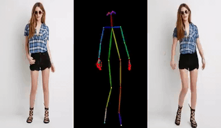
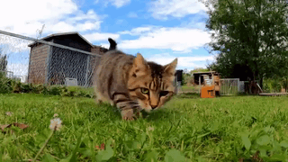
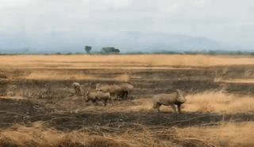
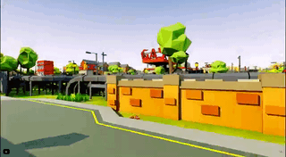
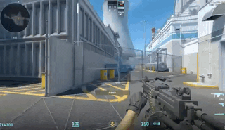
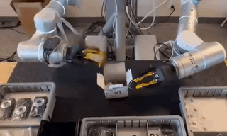
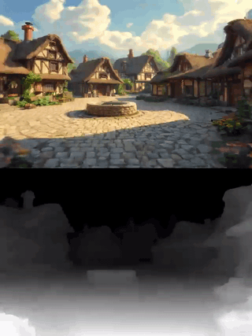
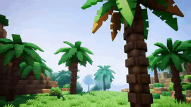

# WorldFoundry

[](pyproject.toml)
[](LICENSE)
[](docs/fumadocs/content/docs/reference/cli.mdx)
[](docs/fumadocs)

WorldFoundry is an open-source infrastructure for world models: a shared stack for in-tree runners, local asset staging, inference (TUI / CLI / Studio), and benchmark evaluation across video generation, 3D/4D representation, embodied action, and interactive worlds.

> ⚠️ This repository is still under active development. We will keep updating it regularly. Feel free to open an issue if you encounter any problem.

Day-one workflow:

1. **Environment + assets** — bootstrap conda, stage checkpoints and datasets outside git.
2. **Inference** — generate and inspect artifacts via TUI, CLI, scripts, or Studio.
3. **Evaluation** — score only after artifacts match the benchmark layout; use scorecards for readiness claims.

## 🤝 Community

Join the **WorldFoundry Community** [Slack / Wechat] for discussions, announcements, technical support, and the latest project updates.

<p align="center">

<a href="https://join.slack.com/t/worldfoundrycommunity/shared_invite/zt-43nbi9fw4-okYiELzZHp0_1UPa3dh3bQ">
  
</a>

<a href="https://github.com/WorldFoundry/WorldFoundry/discussions">
  
</a>

</p>

<p align="center">
  <strong>WeChat Community</strong>
</p>

<p align="center">
  
</p>

<p align="center">
  <em>Scan the QR code to join our WeChat community.<br>
  The QR code is updated periodically if it expires.</em>
</p>

## 📰 News

- **[2026-07-12]** 🔥 **WorldFoundry reached 100+ stars on its very first day!** Thanks to the community for the incredible support and encouragement. More exciting updates are coming!
- **[2026-07-11]** 🎉 **WorldFoundry is officially open-sourced.** We welcome ⭐ stars, bug reports, feature requests, and pull requests from the community!
- **[Coming Soon]** Documentation improvements and additional benchmark integrations.


## Links

- [Documentation](docs/fumadocs/content/docs/index.mdx)
- [Quickstart](docs/fumadocs/content/docs/quickstart.mdx)
- [Environment reference](docs/fumadocs/content/docs/reference/environments.mdx)
- [Local asset preparation](docs/fumadocs/content/docs/guides/local-assets.mdx)
- [TUI](docs/fumadocs/content/docs/guides/tui.mdx)
- [Inference guide](docs/fumadocs/content/docs/guides/inference.mdx)
- [Studio guide](docs/fumadocs/content/docs/guides/studio.mdx)
- [CLI reference](docs/fumadocs/content/docs/reference/cli.mdx)
- [Supported models](docs/fumadocs/content/docs/guides/supported-models.mdx)
- [Benchmark hub](docs/fumadocs/content/docs/evaluation/benchmark-hub/index.mdx)
- [Contributing](CONTRIBUTING.md)

## Demo Gallery

These examples are checked into the documentation site so a new user can see the expected artifact shape before running GPU jobs. Full release claims still require the matching run manifest, runtime profile, and validation scorecard.

<table>
  <tr>
    <td width="33%">
      <a href="https://github.com/OpenEnvision/WorldFoundry/raw/main/docs/fumadocs/public/readme-demos/ltx2-3-i2v-penguin.mp4"></a>
      <br><strong>LTX-2.3</strong><br><sub>Image-to-video</sub>
    </td>
    <td width="33%">
      <a href="https://github.com/OpenEnvision/WorldFoundry/raw/main/docs/fumadocs/public/readme-demos/wan2-1-vace-girl-snake.mp4"></a>
      <br><strong>Wan2.1 VACE</strong><br><sub>Image/control-to-video</sub>
    </td>
    <td width="33%">
      <a href="https://github.com/OpenEnvision/WorldFoundry/raw/main/docs/fumadocs/public/readme-demos/skyreels-v3-reference-to-video.mp4"></a>
      <br><strong>SkyReels V3</strong><br><sub>Reference-to-video</sub>
    </td>
  </tr>
  <tr>
    <td width="33%">
      <a href="https://github.com/OpenEnvision/WorldFoundry/raw/main/docs/fumadocs/public/readme-demos/unianimate-dit-human-animation.mp4"></a>
      <br><strong>UniAnimate-DiT</strong><br><sub>Human animation</sub>
    </td>
    <td width="33%">
      <a href="https://github.com/OpenEnvision/WorldFoundry/raw/main/docs/fumadocs/public/readme-demos/open-sora-plan-tokyo-street.mp4"></a>
      <br><strong>Open-Sora-Plan</strong><br><sub>Text-to-video</sub>
    </td>
    <td width="33%">
      <a href="https://github.com/OpenEnvision/WorldFoundry/raw/main/docs/fumadocs/public/readme-demos/hunyuanvideo-i2v-firework-official.mp4"></a>
      <br><strong>HunyuanVideo I2V</strong><br><sub>Image-to-video</sub>
    </td>
  </tr>
  <tr>
    <td width="33%">
      <a href="https://github.com/OpenEnvision/WorldFoundry/raw/main/docs/fumadocs/public/readme-demos/hunyuanvideo-t2v-cat-grass-official.mp4"></a>
      <br><strong>HunyuanVideo T2V</strong><br><sub>Text-to-video</sub>
    </td>
    <td width="33%">
      <a href="https://github.com/OpenEnvision/WorldFoundry/raw/main/docs/fumadocs/public/readme-demos/cogvideo_01.mp4"></a>
      <br><strong>CogVideoX</strong><br><sub>Text-to-video</sub>
    </td>
    <td width="33%">
      <a href="https://github.com/OpenEnvision/WorldFoundry/raw/main/docs/fumadocs/public/readme-demos/ac3d_02.mp4"></a>
      <br><strong>AC3D</strong><br><sub>Camera/world scene</sub>
    </td>
  </tr>
  <tr>
    <td width="33%">
      <a href="https://github.com/OpenEnvision/WorldFoundry/raw/main/docs/fumadocs/public/readme-demos/astra_02.mp4"></a>
      <br><strong>Astra</strong><br><sub>World navigation</sub>
    </td>
    <td width="33%">
      <a href="https://github.com/OpenEnvision/WorldFoundry/raw/main/docs/fumadocs/public/readme-demos/warp_02.mp4"></a>
      <br><strong>Warp</strong><br><sub>World navigation</sub>
    </td>
    <td width="33%">
      <a href="https://github.com/OpenEnvision/WorldFoundry/raw/main/docs/fumadocs/public/readme-demos/matrix-game-2-official-universal.mp4"></a>
      <br><strong>Matrix-Game-2</strong><br><sub>Interactive world model</sub>
    </td>
  </tr>
  <tr>
    <td width="33%">
      <a href="https://github.com/OpenEnvision/WorldFoundry/raw/main/docs/fumadocs/public/readme-demos/hy-worldplay-official-8gpu.mp4"></a>
      <br><strong>HY-WorldPlay</strong><br><sub>8-GPU image-pose world video</sub>
    </td>
    <td width="33%">
      <a href="https://github.com/OpenEnvision/WorldFoundry/raw/main/docs/fumadocs/public/readme-demos/hunyuan-game-craft-village.mp4"></a>
      <br><strong>Hunyuan GameCraft</strong><br><sub>Interactive village world</sub>
    </td>
    <td width="33%">
      <a href="https://github.com/OpenEnvision/WorldFoundry/raw/main/docs/fumadocs/public/readme-demos/matrix-game-3-cityscape.mp4"></a>
      <br><strong>Matrix-Game-3</strong><br><sub>Cityscape world model</sub>
    </td>
  </tr>
  <tr>
    <td width="33%">
      <a href="https://github.com/OpenEnvision/WorldFoundry/raw/main/docs/fumadocs/public/readme-demos/worldcam-industrial.mp4"></a>
      <br><strong>WorldCam</strong><br><sub>Camera-path world video</sub>
    </td>
    <td width="33%">
      <a href="https://github.com/OpenEnvision/WorldFoundry/raw/main/docs/fumadocs/public/readme-demos/yume-1p5-jungle-castle.mp4"></a>
      <br><strong>YUME-1.5</strong><br><sub>First-person world navigation</sub>
    </td>
    <td width="33%">
      <a href="https://github.com/OpenEnvision/WorldFoundry/raw/main/docs/fumadocs/public/readme-demos/neoverse-robot-tabletop.mp4"></a>
      <br><strong>NeoVerse</strong><br><sub>Robot video-input world model</sub>
    </td>
  </tr>
  <tr>
    <td width="33%">
      <a href="https://github.com/OpenEnvision/WorldFoundry/raw/main/docs/fumadocs/public/readme-demos/hunyuan-world-voyager-case1.mp4"></a>
      <br><strong>HunyuanWorld-Voyager</strong><br><sub>Conditioned world video</sub>
    </td>
    <td width="33%">
      <a href="https://github.com/OpenEnvision/WorldFoundry/raw/main/docs/fumadocs/public/readme-demos/cosmos3.mp4"></a>
      <br><strong>Cosmos3</strong><br><sub>World video generation</sub>
    </td>
    <td width="33%">
      <a href="https://github.com/OpenEnvision/WorldFoundry/raw/main/docs/fumadocs/public/readme-demos/flashworld.mp4"></a>
      <br><strong>FlashWorld</strong><br><sub>World video generation</sub>
    </td>
  </tr>
  <tr>
    <td width="33%">
      <a href="https://github.com/OpenEnvision/WorldFoundry/raw/main/docs/fumadocs/public/readme-demos/sana.mp4"></a>
      <br><strong>Sana</strong><br><sub>Video generation</sub>
    </td>
    <td width="33%">
      <a href="https://github.com/OpenEnvision/WorldFoundry/raw/main/docs/fumadocs/public/readme-demos/lingbot-world.mp4"></a>
      <br><strong>LingBot World</strong><br><sub>World-action generation</sub>
    </td>
    <td width="33%">
      <a href="https://github.com/OpenEnvision/WorldFoundry/raw/main/docs/fumadocs/public/readme-demos/wan2-2.mp4"></a>
      <br><strong>Wan2.2</strong><br><sub>Video generation</sub>
    </td>
  </tr>
  <tr>
    <td width="33%">
      <a href="https://github.com/OpenEnvision/WorldFoundry/raw/main/docs/fumadocs/public/readme-demos/luciddreamer.mp4"></a>
      <br><strong>LucidDreamer</strong><br><sub>World video generation</sub>
    </td>
    <td width="33%">
      <a href="https://github.com/OpenEnvision/WorldFoundry/raw/main/docs/fumadocs/public/readme-demos/gen3c.mp4"></a>
      <br><strong>GEN3C</strong><br><sub>3D-aware video generation</sub>
    </td>
    <td width="33%">
      <a href="https://github.com/OpenEnvision/WorldFoundry/raw/main/docs/fumadocs/public/readme-demos/longcat.mp4"></a>
      <br><strong>LongCat</strong><br><sub>World video generation</sub>
    </td>
  </tr>
</table>

More curated generated samples are embedded in the Studio docs.

## What WorldFoundry Provides

| Surface | Purpose | Entry point |
| --- | --- | --- |
| Model zoo | Catalogs video, world, 3D/4D, VLA/VA/WAM, hosted API, and metadata-only model entries. | [`worldfoundry/data/models/catalog`](worldfoundry/data/models/catalog) |
| In-tree runtimes | Keeps model architecture and inference adapters inside `worldfoundry`; checkpoints stay in local/Hugging Face caches. | [`worldfoundry/synthesis`](worldfoundry/synthesis), [`worldfoundry/pipelines`](worldfoundry/pipelines) |
| TUI | Interactive model/benchmark picker that prints runnable CLI commands. | `worldfoundry-eval tui` / `worldfoundry-tui` |
| Studio workspace | Browser UI for inference jobs, model-specific parameters, and artifact review. | [`worldfoundry.studio.workspace_app`](worldfoundry/studio/workspace_app.py) |
| Benchmark zoo | Catalogs benchmark manifests, required assets, official runner constraints, and readiness states. | [`worldfoundry/data/benchmarks/catalog`](worldfoundry/data/benchmarks/catalog) |
| Evaluation runner | Runs model × benchmark cells, imports existing outputs, and writes normalized scorecards. | [`worldfoundry/evaluation`](worldfoundry/evaluation) |
| Docs | Bilingual Fumadocs site with setup, inference, evaluation, Studio, and maintainer guides. | [`docs/fumadocs`](docs/fumadocs) |

## From Clone To First Run

WorldFoundry uses conda as the supported open-source runtime path. Start with the unified GPU environment; only use a dedicated environment when a model profile documents a real ABI or simulator conflict. The full day-one path lives in the [Quickstart](docs/fumadocs/content/docs/quickstart.mdx).

```bash

# You can clone the repository with all demo videos
git clone https://github.com/OpenEnvision/WorldFoundry.git

# or clone the repository skipping large LFS media files for a much faster download
GIT_LFS_SKIP_SMUDGE=1 git clone https://github.com/OpenEnvision/WorldFoundry.git

cd WorldFoundry

bash scripts/setup/bootstrap_worldfoundry.sh
source tmp/worldfoundry_unified_env.sh
conda activate "${WORLDFOUNDRY_UNIFIED_ENV_PREFIX}"
```

Checkpoints, datasets, evaluator weights, API keys, and generated artifacts are **not** in git.
See [Local asset preparation](docs/fumadocs/content/docs/guides/local-assets.mdx) for cache layout, Hugging Face downloads, non-HF aliases, and benchmark assets.

On modern CUDA 12.8 hosts the installer resolves `worldfoundry-unified-cu128`. Pin a wheel tier only when the host requires it:

```bash
bash scripts/setup/bootstrap_worldfoundry.sh --cuda cu124
bash scripts/setup/bootstrap_worldfoundry.sh --cuda cu121
```

Keep datasets and checkpoints outside the repository on shared machines:

```bash
bash scripts/setup/bootstrap_worldfoundry.sh \
  --home /path/to/worldfoundry-home \
  --data-root /path/to/worldfoundry-data \
  --model-root /path/to/worldfoundry-models \
  --artifact-root /path/to/worldfoundry-artifacts
```

Hugging Face models use native Hub loading (`from_pretrained`, `snapshot_download`, `HF_HOME` / `HF_HUB_CACHE`, and `HF_TOKEN` for gated assets). `WORLDFOUNDRY_CKPT_DIR` remains for non-HF checkpoints and compatibility aliases.

Some VLA/action policies need a documented model-specific environment (for example OpenVLA-OFT / CogACT). Embodied simulator benchmarks follow the Docker VLA harness pattern — see the [environment reference](docs/fumadocs/content/docs/reference/environments.mdx).

After the environment is active:

```bash
worldfoundry-eval --help
worldfoundry-eval zoo models --json
worldfoundry-eval zoo benchmarks --json
```

### Interactive first path (TUI)

```bash
python -m pip install -e ".[tui]"
worldfoundry-eval tui
# or: worldfoundry-tui
```

The TUI reads the same catalogs as the CLI and can print a runnable command before anything expensive runs:

```bash
worldfoundry-eval tui \
  --model-id <model-id> \
  --benchmark-id <benchmark-id> \
  --print-command
```

### Scripted first model run

Prepare assets, then launch a small demo. A common starter is `matrix-game-2` (public HF repo `Skywork/Matrix-Game-2.0`):

```bash
bash scripts/inference/prepare_model_infer.sh matrix-game-2 --download
worldfoundry-eval zoo model-download --model-id matrix-game-2 --check-local --json

bash scripts/inference/test_nav_video_gen.sh matrix-game-2 \
  --output-dir tmp/matrix_game2_first_run
```

If weights already live in a shared checkpoint tree, link them instead of copying:

```bash
bash scripts/setup/link_hf_checkpoints.sh \
  --ckpt-dir "${WORLDFOUNDRY_CKPT_DIR}" \
  --hfd-root "${WORLDFOUNDRY_HFD_ROOT}" \
  --hf-hub-cache "${HF_HUB_CACHE}" \
  --default-world
```

## Run Inference

Prefer the TUI or the documented inference helpers once assets are staged:

```bash
bash scripts/inference/test_nav_video_gen.sh matrix-game-2

conda run -p "${WORLDFOUNDRY_UNIFIED_ENV_PREFIX}" \
  bash scripts/inference/test_nav_video_gen.sh matrix-game-2

bash scripts/inference/run_infer.sh --category video --model <model-id>
bash scripts/inference/run_infer.sh --category three_d_four_d --model <model-id>
```

CLI-shaped inference (same contract as Studio jobs):

```bash
python -m worldfoundry.studio.workspace_job infer \
  --model-id <model-id> \
  --prompt "a cinematic scene, high quality" \
  --output-dir tmp/worldfoundry_infer/<model-id> \
  --device cuda
```

Each successful run should write media, logs, and manifest metadata under the output directory. Treat a file as demo evidence only after visual check and matching runtime-profile assumptions. Details: [Inference guide](docs/fumadocs/content/docs/guides/inference.mdx).

## Launch Studio Workspace

Studio is the preferred UI for release validation: model-specific forms, job status, preview media, and artifact links in one place. Start it from the same unified env used for inference:

```bash
source tmp/worldfoundry_unified_env.sh
conda activate "${WORLDFOUNDRY_UNIFIED_ENV_PREFIX}"

bash scripts/workspace/run_workspace.sh \
  --host 127.0.0.1 \
  --port 7870 \
  --max-jobs 8
```

Open `http://127.0.0.1:7870/`. If `python`, **LOAD**, or **START** fails with a missing interpreter, `cv2`, or `libssl`/`libcrypto` error, recreate or verify the env and restart:

```bash
bash scripts/setup/bootstrap_worldfoundry.sh --verify-only
source tmp/worldfoundry_unified_env.sh
bash scripts/workspace/run_workspace.sh
```

Configure jobs in **Create Job**; optional shared defaults can use `WORLDFOUNDRY_STUDIO_SETTINGS_FILE`. Expensive runtime checks and preview builders are opt-in via `WORLDFOUNDRY_STUDIO_*` — see the [Studio guide](docs/fumadocs/content/docs/guides/studio.mdx).

Use the **Visualizers** tab as the browser entrypoint for local preview services (World / Gradio, Spark, Viser, Rerun, Embodied bridge). On a remote machine, forward port `7870` plus any viewer ports you launch.

For a single-model Studio process:

```bash
worldfoundry-studio
```

## Run Evaluation

Run evaluation through a runnable benchmark path. Use `official-run` when the evaluator can execute locally; use `official-validation` when you already have official-shaped result files to import.

```bash
worldfoundry-eval run \
  --model matrix-game-2 \
  --benchmark vbench \
  --mode official-run \
  --output-dir tmp/hello_world_run \
  --json
```

Inspect:

- `run_manifest.json`: selected model, benchmark/task metadata, timestamps, and output paths.
- `results.jsonl`: per-sample generation records and artifact metadata.
- `metrics/summary.json`: aggregate metrics and failed/skipped sample counts.
- `scorecard.json`: readiness, leaderboard eligibility, metric values, and blockers.

For model and benchmark discovery:

```bash
worldfoundry-eval tasks list
worldfoundry-eval zoo models --json
worldfoundry-eval zoo benchmarks --json
worldfoundry-eval zoo model-show --model-id <model-id> --include-manifest --json
worldfoundry-eval zoo benchmark-show --benchmark-id <benchmark-id> --include-spec --json
```

For existing official-shaped benchmark outputs:

```bash
worldfoundry-eval zoo benchmark-run \
  --benchmark-id vbench \
  --mode official-validation \
  --official-results-path <official_results.json> \
  --generated-artifact-dir <generated_videos> \
  --output-dir tmp/benchmark_zoo/official_validation/vbench \
  --json
```

For existing generated outputs:

```bash
worldfoundry-eval evaluate \
  --results-path tmp/results.jsonl \
  --output-dir tmp/worldfoundry_evaluate \
  --metric artifact_count \
  --required-artifact video \
  --json
```

For the formal benchmark inventory, review the expanded plan first:

```bash
worldfoundry-eval prepare \
  --all-benchmarks \
  --output-dir tmp/worldfoundry_all_benchmarks_plan \
  --json

worldfoundry-eval run \
  --all-benchmarks \
  --model <model-zoo-id> \
  --prepare \
  --data-root cache/worldfoundry/data/hfd_datasets \
  --plan-only \
  --output-dir tmp/worldfoundry_all_benchmarks_plan \
  --json
```

Use the integrity commands before claiming benchmark support:

```bash
worldfoundry-eval zoo benchmarks --json
worldfoundry-eval run --plan-only --json
```

For release audits, use public CLI surfaces only:

```bash
worldfoundry-eval validate-artifact --json
```

Contract runs, normalizer-only imports, partial dataset runs, and missing-official-runner checks are not leaderboard evidence. A public claim needs the full official data/runtime path and a scorecard whose eligibility fields explicitly support the claim.

## Documentation Site

Run the docs locally:

```bash
cd docs/fumadocs
npm ci
npm run dev -- --port 8014
```

Build the static docs from the repository root:

```bash
bash scripts/docs/build.sh
```

The docs app serves English routes under `/docs` and Chinese routes under `/zh/docs`.

## Development Checks

Use these checks before opening a PR or marking a model/benchmark ready:

```bash
source tmp/worldfoundry_unified_env.sh
conda activate "${WORLDFOUNDRY_UNIFIED_ENV_PREFIX}"

PYTHONPATH=. python -m compileall -q worldfoundry scripts
PYTHONPATH=. python -m pytest -m fast_eval_core test/eval_core
bash scripts/docs/build.sh --skip-bootstrap

worldfoundry-eval zoo model-download --model-id <model-id> --check-local --json
worldfoundry-eval zoo benchmark-download --benchmark-id <benchmark-id> --check-local --json
worldfoundry-eval run --plan-only --fail-on-overclaim --fail-on-stale --json
```

When adding or changing a model:

1. Port required inference code into `worldfoundry`; do not depend on a cloned external repo at runtime.
2. Keep official repositories only as provenance or parity references.
3. Declare checkpoints, runtime variables, and environment assumptions in the model catalog/runtime profile.
4. Run the smallest official-style demo and visually inspect the artifact.
5. Record evidence in the docs before promoting readiness.

## Repository Layout

```text
WorldFoundry
├─ docs/fumadocs                         # Documentation site, teaser, screenshots, and demo media
├─ requirements                          # Unified and optional dependency presets
├─ scripts
│  ├─ inference                          # User-facing inference entrypoints
│  ├─ setup                              # Conda setup wrappers
│  ├─ workspace                          # Studio / Workspace launch helpers
│  └─ docs                               # Documentation build wrapper
├─ worldfoundry
│  ├─ core                               # Shared contracts and reusable runtime abstractions
│  ├─ data                               # Model/benchmark catalogs, runtime profiles, fixtures
│  ├─ evaluation                         # Runner, tasks, metrics, scorecards, reports
│  ├─ operators                          # Input validation, preprocessing, interaction handling
│  ├─ pipelines                          # User-facing pipeline wrappers
│  ├─ representations                    # 3D/4D and spatial representation outputs
│  ├─ runtime                            # Runtime paths, assets, jobs, and probes
│  ├─ studio                             # Workspace and Studio frontends
│  └─ synthesis                          # In-tree model synthesis/action-generation runtimes
├─ test                                  # Test suites
├─ thirdparty                            # Reviewed vendored/native dependencies
└─ tools                                 # Maintenance and asset utilities
```

## Citation

If you use WorldFoundry or its benchmark/model integrations in research, cite this repository and the upstream methods, checkpoints, datasets, and benchmarks that your run depends on. A formal paper citation will be added when the technical report is released.

## Acknowledgment

WorldFoundry integrates and wraps a large set of upstream world-model, video-generation, perception, reconstruction, and embodied-action projects. See the method-specific runtime profiles and the docs appendix for upstream project pointers and licenses.

We also thank the following open-source projects for their design, runtime, and evaluation ideas that informed WorldFoundry:

- [FlashDreams](https://github.com/NVIDIA/flashdreams) — high-performance inference and serving for interactive autoregressive video and world models
- [FastVideo](https://github.com/hao-ai-lab/FastVideo) — a unified inference and post-training framework for accelerated video generation
- [OpenWorldLib](https://github.com/OpenDCAI/OpenWorldLib) — a unified codebase for advanced world models
- [VLA Evaluation Harness](https://github.com/allenai/vla-evaluation-harness) — one framework to evaluate VLA models on robot simulation benchmarks
